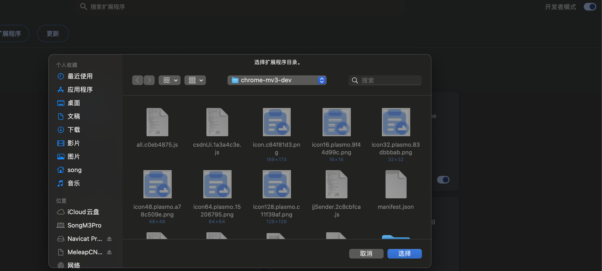

# 文章同步助手

可以帮助你同步你的csdn文章到其他平台，如博客园、掘金、知乎、简书等，使用plasmo + react + antd框架开发。

## 同步文章的时候，有个状态说明

有个状态说明或者弹窗提示，说正在同步，或者同步完成。

## 本地开发安装

node版本：v21.7.1

pnpm安装使用

```
pnpm install
```

本地开发

```
pnpm run dev
```

chrome安装:  
打开chrome浏览器插件管理页面，点击加载已解压的扩展程序，选择项目根目录下的build文件夹下面的chrome-mv3-dev文件，然后就可以了：  


## 功能

-   支持同步文章到多个平台
-   支持自定义文章标题、摘要、分类、标签
-   支持自定义文章封面
-   支持文章缓存
-   支持屏蔽csdn等平台广告
-   支持自定义同步规则
-   auto replace image url

## TODO

-   添加一键转发到掘金等平台的功能
-   添加掘金签到的功能
-   掘金摘要长度最低50啊啊啊
-   添加文章已经发布状态同步，如果已经发布了，就不再将文章同步到其他平台
